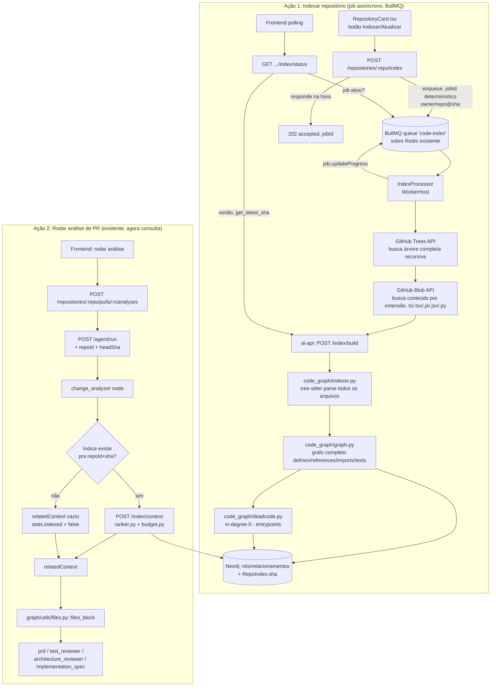

# Design — Code Graph / Repo Map

**Spec**: `.specs/features/code-graph-context/spec.md`
**Status**: Draft (revisado — indexação é ação separada e persistida, não acontece dentro do run de análise)

---

## Visão geral da arquitetura

**Duas ações desacopladas**, não uma:

1. **Indexar repositório** (P1) — ação explícita do usuário, roda uma vez (ou sob demanda pra reindex), busca o repo inteiro, constrói grafo completo, persiste. CPU-bound, pode demorar, não bloqueia nada.
2. **Rodar análise de PR** (P2, fluxo já existente) — consulta o índice já persistido, nunca reparseia nada. Rápido, é o caminho que já existe hoje só que agora enriquecido.

Isso resolve o buraco da primeira versão deste design: pra achar caller de um símbolo é preciso já ter visibilidade do repo inteiro — não dá pra descobrir isso só olhando os arquivos que a PR tocou. Indexação full-repo é pré-requisito, não otimização.

**Correção pós-design (repo grande, ~1k+ arquivos):** buscar a árvore inteira e mandar tudo numa `POST /index/build` só, dentro do ciclo de vida de uma request HTTP síncrona, não escala — payload de vários MB pode estourar limite de proxy, e a request do usuário fica presa esperando o processo inteiro (fetch + parse + persist) terminar. Indexação vira **job assíncrono via BullMQ**, rodando sobre o mesmo Redis que já existe no `docker-compose.yml` (nenhuma infra nova pro backend usar fila — só uma dependência nova, `@nestjs/bullmq`). O endpoint `POST /repositories/:repo/index` enfileira e responde na hora; um `IndexProcessor` (worker) faz o trabalho pesado fora do request/response cycle do usuário.



---

## Análise de reuso de código

### Componentes existentes a aproveitar

| Componente | Local | Como usar |
|---|---|---|
| `RepositoriesController`/`RepositoriesService` | `apps/backend/src/modules/repositories/` | Ganha novo endpoint `POST /:repo/index` no mesmo controller — já é quem fala com Octokit hoje (`repositories.service.ts:61-88`) |
| Padrão de busca de conteúdo GitHub | `context-builder.helper.ts` (`fetchWithExtensionFallback`) | Mesmo client Octokit, mas trocando "buscar 1 arquivo" por "buscar árvore inteira" (Trees API) — padrão de autenticação/erro já existe |
| `RepositoryCard.tsx` / `useRepositories.ts` / `repositories.api.ts` | `apps/frontend/src/{components/repos,hooks,api}/` | Ganham ação "Indexar" + exibição de status (CGC-16) |
| `change_analyzer` node | `apps/ai-api/app/graph/nodes/change_analyzer` | Deixa de tentar indexar — vira só consumidor: consulta índice, monta `relatedContext` |
| `files_block` | `apps/ai-api/app/graph/utils/files.py` | Ganha parâmetro `repoMap`/`callers`/`deadCodeCandidates` |
| `REDIS_URL` / padrão de client singleton em `app.state` (`main.py` lifespan) | `apps/ai-api/app/main.py:4,14`, `settings.py:13` | Lock de indexação concorrente reusa Redis (namespace `idxlock:*`, isolado do checkpoint do LangGraph); grafo em si NÃO fica no Redis — ver `code_graph/cache.py` abaixo (Decisão A12) |
| `import-resolver.helper.ts` | `apps/backend/src/modules/analyses/helpers/import-resolver.helper.ts` | Fica como está — é o comportamento que já roda quando `stats.indexed = false` (repo nunca indexado), não precisa de nenhuma mudança pra servir de fallback |
| `ChangedFileContext` | `apps/backend/src/shared/types.ts:17-22` | Estendido com `relatedContext` opcional |
| `Analysis` entity | `apps/backend/src/modules/analyses/analysis.entity.ts` | Nenhuma mudança de schema necessária pra indexação em si — `owner`/`repo`/`pullNumber` já existem e bastam pra formar `repoId` |

### O que não existe e precisa ser criado do zero

| Necessidade | Por quê não dá pra reusar nada |
|---|---|
| Busca de árvore completa do repo (GitHub Trees API) | Hoje só existe busca de arquivo individual (`fetchWithExtensionFallback`); nunca foi preciso listar o repo inteiro |
| Persistência de "repo foi indexado" | Confirmado: não existe entidade `Repo` no backend, repos são sempre live-fetched via PAT (`repositories.service.ts`). Estado de indexação mora inteiramente no `ai-api`, backend não precisa persistir nada — só chama o endpoint e repassa status na resposta |
| Banco de grafo (Neo4j) | Não existia nenhuma peça de infra pra isso — novo serviço no `docker-compose.yml` (`neo4j:5-community` + plugin `graph-data-science`), novo driver Python (`neo4j`) |
| Lock/dedupe de indexação concorrente | Nada parecido existe hoje — precisa de lock simples em Redis (`SETNX` ou similar) pra cobrir caso de borda do spec (2 indexações simultâneas do mesmo repo@sha) |

---

## Componentes

### `POST /repositories/:repo/index` (novo, backend) — enfileira, não processa

- **Propósito**: enfileira job de indexação (CGC-25) e responde imediatamente — todo trabalho pesado (fetch + parse + persist) sai do ciclo de vida da request, vira responsabilidade do `IndexProcessor`
- **Local**: `apps/backend/src/modules/repositories/repositories.controller.ts` (novo método), `repositories.service.ts` (nova função `enqueueIndexJob`)
- **Interfaces**:
  - `POST /repositories/:repo/index?owner=` → `202 { jobId, status: 'queued' }` (não espera o job terminar)
  - `GET /repositories/:repo/index/status?owner=` → `{ status: 'not_indexed' | 'queued' | 'indexing' | 'indexed', sha: string | null, stale: boolean, progress?: number }` (CGC-16 — consulta job ativo via `jobId` determinístico; se não há job, consulta `ai-api` `get_latest_sha`)
- **Dependências**: `@InjectQueue('code-index')` (BullMQ), Octokit (já injetado em `RepositoriesService`)
- **Reusa**: padrão de erro de `repositories.service.ts`

### `IndexQueue` + `IndexProcessor` (novo, backend, BullMQ)

- **Propósito**: fila `code-index` (BullMQ sobre o Redis já existente) + worker que faz o trabalho que antes estava direto no controller — busca árvore, chama `ai-api`
- **Local**: `apps/backend/src/modules/repositories/indexing/index.processor.ts`, registro via `BullModule.registerQueue({name: 'code-index'})` no módulo
- **Interfaces**:
  - `IndexProcessor extends WorkerHost` — `async process(job: Job<IndexJobData>)`: `fetchRepoTree` → `POST /index/build` no `ai-api` → `job.updateProgress(...)` nos dois marcos
  - `jobId` determinístico: `` `${owner}/${repo}@${sha}` `` (sem `:` — restrição do BullMQ, colide com convenção de chave do Redis) — BullMQ ignora silenciosamente um segundo `add()` com o mesmo `jobId` enquanto o anterior não foi removido, cobrindo o caso de borda de indexação duplicada (CGC-25) sem lógica própria
- **Dependências**: `tree-fetcher.helper.ts` (T9), `ai-api.client.ts`
- **Reusa**: nada — capacidade nova (backend não tinha fila antes desta feature)

### `code_graph/tree_fetcher.ts` (novo, backend)

- **Propósito**: busca árvore completa do repo via GitHub Trees API (recursiva), filtra extensões suportadas, busca conteúdo (batched) — chamado pelo `IndexProcessor`, não pelo controller diretamente
- **Local**: `apps/backend/src/modules/repositories/helpers/tree-fetcher.helper.ts`
- **Interfaces**:
  - `fetchRepoTree(owner: string, repo: string, sha: string): Promise<{path: string, content: string}[]>`
- **Dependências**: Octokit `git.getTree({recursive: true})` + `repos.getContent` por blob (ou `git.getBlob` por sha do blob, mais eficiente que Contents API pra volume alto)
- **Reusa**: nada — capacidade nova

### `code_graph/indexer.py` (novo, ai-api)

- **Propósito**: parsear arquivos via tree-sitter e extrair nós/arestas brutas
- **Local**: `apps/ai-api/app/code_graph/indexer.py`
- **Interfaces**:
  - `parse_file(path, content, language) -> ParsedSymbols`
  - `resolve_import(raw_import, from_path, tsconfig, pyproject) -> str | None`
- **Dependências**: `tree-sitter`, `tree-sitter-language-pack` (novo)
- **Reusa**: nada

### `code_graph/graph.py` (novo, ai-api)

- **Propósito**: montar grafo completo (todos os arquivos do repo, não só PR) — nós + arestas `defines/references/imports/tests`
- **Local**: `apps/ai-api/app/code_graph/graph.py`
- **Interfaces**:
  - `build_graph(parsed: list[ParsedSymbols]) -> Graph`
  - `detect_test_edges(graph, test_patterns) -> Graph`
- **Dependências**: saída do indexer
- **Reusa**: nada — não existe mais versão "rasa" separada, grafo é sempre completo desde P1 (a diferença agora é *quando* ele é calculado — na indexação, não no run)

### `code_graph/deadcode.py` (novo, ai-api)

- **Propósito**: identifica símbolos com in-degree 0 em `references`, exclui entrypoints conhecidos
- **Local**: `apps/ai-api/app/code_graph/deadcode.py`
- **Interfaces**:
  - `find_dead_candidates(graph: Graph, entrypoint_rules: EntrypointRules) -> list[Symbol]`
- **Dependências**: `Graph` completo
- **Reusa**: nada
- **Heurística de entrypoint (CGC-18)**: símbolo é entrypoint (não é dead) se: (a) exportado de `index.ts`/`__init__.py` do pacote, (b) decorado com decorator de rota conhecido (`@Controller`/`@Get`/`@Post` do Nest, `@app.route`/FastAPI `@router.get` etc. — lista configurável), (c) é `main`/`if __name__ == "__main__"`, (d) só tem caller em arquivo de teste (aí é "só testado", não "morto", mas sinalizado separado — ver campo abaixo)

### `code_graph/ranker.py` (novo, ai-api)

- **Propósito**: PageRank personalizado, rodando **dentro do Neo4j** via GDS (Graph Data Science), não em Python — dado um conjunto de arquivos alterados como vetor de personalização
- **Local**: `apps/ai-api/app/code_graph/ranker.py`
- **Interfaces**:
  - `rank(driver, repo_id, sha, changed_files: list[str]) -> list[ScoredNode]` — projeta subgrafo via `gds.graph.project`, roda `gds.pageRank.stream` com `sourceNodes` (personalização), lê resultado
- **Dependências**: driver Neo4j (Decisão A12/A14), grafo já persistido por `cache.build_and_store`
- **Reusa**: nada — mas substitui a implementação manual (power iteration) planejada na primeira versão deste design, ver Decisão A14

### `code_graph/deadcode.py` (ai-api) — nota pós-pivot

Continua rodando em Python puro sobre o `Graph` pydantic carregado via `cache.lookup` (não em Cypher) — in-degree check é barato o bastante que não justifica push-down agora. Se o `find_dead_candidates` virar gargalo com grafo muito grande, é candidato natural a virar query Cypher também (`MATCH (s:Symbol)` `WHERE NOT ()-[:REFERENCES]->(s)`), mas não é feito nesta fase.

### `code_graph/budget.py` (novo, ai-api)

- **Propósito**: seleciona o que entra no contexto sob `tokenBudget`, cortando por símbolo, alocação 60/30/10
- **Local**: `apps/ai-api/app/code_graph/budget.py`
- **Interfaces**:
  - `select(ranked: list[ScoredNode], changed_files: list[ParsedFile], token_budget: int) -> RelatedContext`
- **Dependências**: saída do ranker
- **Reusa**: substitui `slice()` de `context-builder.helper.ts:115` e de `graph/utils/files.py`

### `code_graph/cache.py` (novo, ai-api) — armazenamento híbrido Neo4j + Redis

- **Propósito**: persistência do grafo **em Neo4j** (nós/relacionamentos reais, não blob serializado), por `repo@sha` via propriedades `repoId`/`sha` em cada nó; lock de indexação concorrente continua em Redis (Decisão A12)
- **Local**: `apps/ai-api/app/code_graph/cache.py`
- **Interfaces**:
  - `build_and_store(repo_id, sha, graph: Graph) -> None` — apaga **todo** nó daquele `repoId` (qualquer sha antigo, não só o que tá sendo escrito — Decisão A16, evita acumular grafo de commit velho pra sempre), recria via Cypher `CREATE`, atualiza nó `:RepoIndex {repoId}` com `sha`/`indexedAt`; chamado só por `/index/build` (P1), nunca pelo caminho de análise
  - `lookup(repo_id, sha) -> Graph | None` — reconstrói `Graph` pydantic a partir de `MATCH` no Neo4j; chamado por `/index/context`/`change_analyzer` (P2) e por `ranker.py` antes de projetar o subgrafo pro GDS
  - `get_latest_sha(repo_id) -> str | None` (CGC-26) — lê `:RepoIndex.sha`, O(1), usado pelo endpoint de status (T21) pra responder "indexado, sha X" sem o backend precisar saber a sha de antemão
  - `acquire_lock(repo_id, sha) -> bool` / `release_lock(...)` — Redis `SETNX`+TTL, cobre caso de borda de indexação concorrente (redundante com o dedupe de `jobId` do BullMQ no backend — de propósito, defesa em camada, protege também um chamador futuro que bata em `/index/build` direto sem passar pela fila, ex. MCP P5)
- **Dependências**: driver `neo4j` (novo), `REDIS_URL` já configurado
- **Reusa**: conexão Redis existente (namespace `idxlock:*`) só pro lock; Neo4j é infra nova (Decisão A12)

### `api/routes/index.py` (novo, ai-api)

- **Propósito**: expõe `POST /index/build` (só chamado pelo fluxo de indexação) e `POST /index/context` (chamado por `change_analyzer` E standalone por MCP futuro — P5)
- **Local**: `apps/ai-api/app/api/routes/index.py`
- **Interfaces**:
  - `POST /index/build` → `{repoId, sha, files}` → `{indexId, stats}`
  - `POST /index/context` → `{repoId, sha, changedFiles, tokenBudget}` → `{relatedContext}` (retorna `stats.indexed=false` se não achar índice, não erro)
- **Dependências**: `cache.py`, `ranker.py`, `budget.py`, `deadcode.py`
- **Reusa**: mesmo padrão de router de `agent.py`

### `code_graph/viz.py` (novo, ai-api, P6)

- **Propósito**: serializa o grafo persistido em formato nós/arestas consumível por lib de visualização; agrega por diretório/módulo quando acima do limite renderizável; suporta expansão sob demanda a partir de um nó foco
- **Local**: `apps/ai-api/app/code_graph/viz.py`
- **Interfaces**:
  - `serialize_overview(graph: Graph, max_nodes: int) -> VizGraph` — visão agregada por diretório/módulo (CGC-22)
  - `expand_neighborhood(graph: Graph, focus_id: str, depth: int) -> VizGraph` — vizinhança de um nó específico (CGC-23)
- **Dependências**: `cache.lookup` (grafo já em memória, sem reparse)
- **Reusa**: `Graph`/`Symbol`/`Edge` models

### `GET /index/graph` (novo, ai-api, P6)

- **Propósito**: expõe `viz.py` como endpoint HTTP
- **Local**: `apps/ai-api/app/api/routes/index.py` (nova rota)
- **Interfaces**: `GET /index/graph?repoId=&sha=&focus=&depth=` → `VizGraph` (nós/arestas + `stats.indexed`)
- **Dependências**: `code_graph/viz.py`
- **Reusa**: mesmo router de `/index/build`/`/index/context`

### `GET /repositories/:repo/graph` (novo, backend, P6)

- **Propósito**: passthrough do endpoint de visualização do `ai-api`
- **Local**: `apps/backend/src/modules/repositories/repositories.controller.ts`
- **Reusa**: `ai-api.client.ts` (mesmo client de T10/T21)

### `RepoGraphPage.tsx` (novo, frontend, P6)

- **Propósito**: renderiza o grafo interativo — visão agregada inicial, clique expande vizinhança
- **Local**: `apps/frontend/src/pages/RepoGraphPage.tsx`
- **Dependências**: `@xyflow/react` (React Flow) — biblioteca nova, frontend hoje não tem nenhuma lib de grafo/diagrama (confirmado: `package.json` só tem react/react-dom/react-router-dom)
- **Reusa**: `useRepositories.ts` pattern pra estado de loading/erro; CTA reusa o mesmo fluxo de indexação de `RepositoryCard.tsx` (T11) quando `stats.indexed=false`

### `change_analyzer` (modificado, ai-api)

- **Propósito**: deixa de conter qualquer lógica de parse/grafo — vira cliente HTTP interno de `/index/context` (ou chama `cache.lookup` + `ranker` + `budget` diretamente, sem round-trip HTTP já que é o mesmo processo)
- **Local**: `apps/ai-api/app/graph/nodes/change_analyzer`
- **Mudança chave**: nenhum `try/except` de parse é mais necessário aqui — se o índice não existe, é um `None` simples de `cache.lookup`, não uma exceção de parse. Fallback vira "índice ausente", não "parse falhou"

---

## Modelos de dados

### `ParsedSymbols`, `Graph`, `Edge`, `Symbol` — inalterados da versão anterior

```python
class Symbol(BaseModel):
    id: str
    kind: Literal["file", "function", "class", "method"]
    path: str
    name: str
    line: int
    end_line: int
    signature: str

class Edge(BaseModel):
    from_id: str
    to_id: str
    kind: Literal["defines", "references", "imports", "tests"]
    weight: float = 1.0

class Graph(BaseModel):
    nodes: dict[str, Symbol]
    edges: list[Edge]
```

### `RelatedContext` — ganha `deadCodeCandidates` e `stats.indexed`

```python
class SymbolRef(BaseModel):
    path: str
    name: str
    signature: str
    body: str | None

class IndexStats(BaseModel):
    indexed: bool           # False = repo nunca indexado, tudo abaixo é vazio
    stale: bool = False     # True = índice existe mas é de sha anterior
    indexed_files: int = 0
    skipped_files: int = 0
    budget_used: int = 0
    truncated: bool = False

class RelatedContext(BaseModel):
    callers: list[SymbolRef]
    callees: list[SymbolRef]
    tests: list[SymbolRef]
    dead_code_candidates: list[SymbolRef]
    repo_map: str
    stats: IndexStats
```

### `IndexResult` (retorno de `/index/build`)

```python
class IndexResult(BaseModel):
    index_id: str            # = f"{repo_id}@{sha}"
    indexed_files: int
    skipped_files: int
    duration_ms: int
```

**Relacionamentos**: `Graph` (pydantic) é a representação em memória usada por `graph.py`/`deadcode.py`/os testes — mas a persistência real (`cache.build_and_store`) não serializa esse objeto como blob; escreve cada `Symbol` como nó `:Symbol` e cada `Edge` como relacionamento tipado (`:REFERENCES`, `:IMPORTS`, `:DEFINES`, `:TESTS`) no Neo4j, tageados por `repoId`/`sha`. `lookup` faz o caminho inverso (`MATCH` → reconstrói `Graph`). `RelatedContext` é sempre derivado on-the-fly — nunca persistido ele mesmo (é por-request, depende do `tokenBudget` do chamador).

---

## Estratégia de tratamento de erro

| Cenário | Tratamento | Impacto pro usuário |
|---|---|---|
| Arquivo individual falha o parse durante `/index/build` (CGC-03) | Pulado, contabilizado em `stats.skippedFiles`, indexação do resto continua | Nenhum — indexação completa com esse arquivo de fora |
| Repo nunca foi indexado, PR chega pra análise (CGC-12) | `cache.lookup` retorna `None`, `relatedContext` vem vazio com `stats.indexed=false` | Review roda normal, sem contexto de grafo — UI pode sugerir "indexe este repo pra reviews melhores" |
| Índice existe mas é de commit anterior (stale) | Usado mesmo assim (best-effort), `stats.stale=true` | Contexto pode estar levemente desatualizado; sinalizado, não escondido |
| Indexação disparada 2x em paralelo pro mesmo `repo@sha` | `acquire_lock` — segunda chamada espera ou retorna "já em andamento" | Sem indexação duplicada, sem corrupção de cache |
| GitHub Trees API falha ou repo é gigante (rate limit, timeout) | Backend retorna erro explícito pro `POST /repositories/:repo/index`, não inicia build parcial silencioso | Usuário vê erro claro, pode tentar de novo |
| Neo4j indisponível | `/index/build` falha explicitamente (não é o caso de "degrada" — sem Neo4j não tem onde persistir o grafo) | Indexação nova falha visível ao usuário |
| Redis indisponível (lock) | `acquire_lock` sem Redis quebra a chamada — hoje sem fallback explícito; indexação simplesmente não roda até Redis voltar | Mesmo status de "Redis indisponível" que o resto do `ai-api` já tem hoje (checkpoint do LangGraph também depende dele) — não é regressão nova |

---

## Decisões técnicas (só as não-óbvias)

| Decisão | Escolha | Racional |
|---|---|---|
| Indexação é ação separada de análise | Sim — dois endpoints, dois momentos | Sem isso não dá pra achar caller fora da PR; é a correção de rota desta sessão, não opcional |
| Quem busca a árvore completa do repo | Backend (Nest), reusando Octokit já injetado | `ai-api` não tem client GitHub hoje e a fronteira documentada mantém GitHub só no Nest |
| Como buscar árvore completa | GitHub Trees API recursiva + `git.getBlob` por arquivo | Trees API dá a lista inteira numa chamada; `getBlob` por sha é mais barato que `getContent` por path quando o volume é alto |
| Onde mora o estado "repo indexado" | No Neo4j do `ai-api` (nós/relacionamentos, tageados `repoId`/`sha`) — backend não persiste nada | Confirmado que não existe entidade `Repo` hoje; criar uma só pra isso duplicaria estado. Trocado de Redis-como-blob pra Neo4j-como-grafo-de-verdade em sessão de revisão de design — ver Decisão A12 no ADR: banco de grafo nativo permite empurrar PageRank (GDS) e consultas de vizinhança pra dentro do banco, em vez de sempre carregar o grafo inteiro em memória Python |
| Grafo tem versão "rasa" separada da "completa"? | Não mais — sempre completo, construído uma vez na indexação | A distinção Fase1(raso)/Fase2(completo) da versão anterior deste design não fazia sentido depois do pivot: o grafo raso não resolvia o problema de qualquer forma |
| Dead code — heurística de entrypoint | Lista configurável de decorators/padrões conhecidos + regra de export + regra de teste-só | Sem isso, toda rota HTTP e todo `main()` viraria falso positivo — inaceitável pro reviewer confiar no sinal |
| Reindex automático (webhook) | Fora de escopo v1, manual | Confirmado: zero infra de webhook no repo hoje; construir isso é escopo de outra feature |
| Lock de indexação concorrente | Redis `SETNX` simples com TTL — continua em Redis mesmo após o grafo migrar pra Neo4j | Lock é coordenação efêmera (TTL, nunca consultado como dado), não é "a transação" que o grafo é — Redis é a ferramenta certa pra isso, Neo4j é a ferramenta certa pro grafo. Ver Decisão A12 |
| PageRank em Python (manual) ou empurrado pro banco? | Empurrado — `CALL gds.pageRank.stream` dentro do Neo4j via plugin Graph Data Science (Community Edition, grátis, confirmado antes de decidir) | Motivo original de evitar `networkx` (puxa numpy/scipy escondido, ver ADR Decisão A2) continua válido, mas agora existe opção melhor que "escrever na mão": banco de grafo já resolve isso nativamente, sem carregar grafo inteiro em memória Python pra rankear. Supersede a Decisão A2 do ADR — ver Decisão A14 |
| Lib de renderização de grafo (P6) | `@xyflow/react` (React Flow) | Padrão de mercado pra grafo interativo em React, MIT, suporta nós customizados + expansão incremental; frontend não tem nada parecido hoje, dependência nova assumida conscientemente |
| Grafo inteiro na tela de uma vez? | Não — agregação por diretório/módulo + expansão sob demanda | Repo com centenas/milhares de símbolos trava renderização se jogado cru; mesma lógica de "orçamento" do budget.py, aplicada à UI em vez de ao prompt |
| Indexação de repo grande — request síncrona ou job assíncrono? | Job assíncrono (BullMQ, fila `code-index` sobre o Redis já existente) | Testado o cenário de 1k+ arquivos: buscar tudo + mandar numa `POST` só estoura limite de payload de proxy e prende a request do usuário até terminar. Job assíncrono resolve os dois: endpoint responde na hora (202), trabalho pesado roda fora do request/response cycle do browser |
| Dedupe de indexação concorrente do lado do backend | `jobId` determinístico (`owner/repo@sha`) — BullMQ ignora `add()` duplicado enquanto job anterior não foi removido | Sem lógica própria de lock no backend — a mesma garantia que `acquire_lock` dá no `ai-api` (Redis `SETNX`), só que a nível de fila. As duas camadas continuam existindo (defesa em profundidade, não redundância descartável) — `ai-api` protege contra qualquer chamador de `/index/build`, não só o worker do backend |
| Status de indexação — polling ou WebSocket/SSE? | Polling simples (`GET /index/status`) | Escopo do MVP não justifica canal persistente; BullMQ já expõe `job.progress` synchronously via `Queue.getJob(jobId)`, então polling de poucos em poucos segundos é barato e suficiente. WebSocket/SSE fica como upgrade se a UX pedir |

---

## Prior art — GitNexus

[GitNexus](https://github.com/abhigyanpatwari/GitNexus) é produto standalone (LadybugDB própria, 17 tools MCP, clustering Leiden, PDG, taint analysis, CLI+hooks) — escopo bem maior que o CGC. Não é modelo a seguir 1:1, mas valida a correção de rota desta sessão: eles também separam indexação (`gitnexus analyze`, ação explícita, persistida) de consulta (tools MCP, sempre contra índice já pronto) — é literalmente a mesma separação de responsabilidade que este design adotou depois de identificar o buraco da primeira versão. `detect_changes` deles (git-diff → símbolos afetados, contra índice já construído) é conceitualmente idêntico ao P2 daqui.

**Atualização pós-implementação:** a primeira versão deste design divergia aqui — "Redis resolve sem justificar storage engine novo". Discussão posterior (ver ADR Decisão A12) reverteu esse ponto: o grafo é dado persistido/consultável (não cache descartável), e Redis-como-blob não dava nenhuma vantagem real sobre reconstruir do zero. A convergência final é mais perto do GitNexus do que a v1 deste design assumia — Neo4j (Community + GDS) é banco de grafo nativo, mais modesto que o LadybugDB deles (sem WASM, sem multi-repo em memória de sessão), mas mesma categoria de ferramenta, não mais um blob KV fingindo ser grafo.

---

## Riscos herdados do spec que o design precisa mitigar

- **CGC-12 (degradação sem índice)**: `cache.lookup` retorna `None` de forma limpa, nunca lança exceção — `change_analyzer` trata `None` como caminho normal, não como erro.
- **CGC-18 (falso positivo de dead code)**: heurística de entrypoint é lista viva, não hardcoded — precisa ficar fácil de estender quando aparecer padrão novo (ex: handler de fila, cron job) que hoje não está coberto.
- **PRD 01 ausente**: `IndexStats`/`RelatedContext` desenhados pra serem consumíveis por eval harness futuro sem retrabalho de payload.
