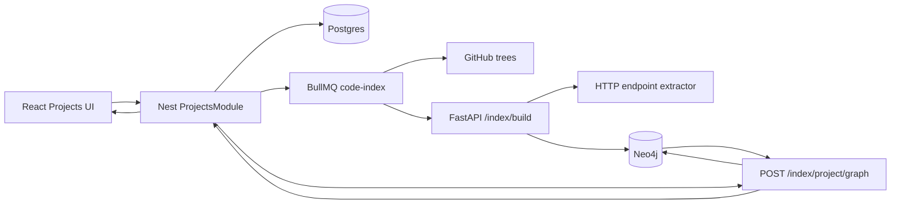

# Cross-Repo Core Design

**Spec:** `.specs/features/cross-repo-core/spec.md`  
**Status:** Implemented

## Architecture Overview



Postgres é o control plane de projetos e membros. Neo4j é o knowledge plane de símbolos, endpoints e relações materializadas. A fila existente continua responsável por buscar e indexar cada repositório.

## Code Reuse

| Existing component | Reuse |
| --- | --- |
| `RepositoriesService` | Lista autorizada, HEAD SHA, enqueue e status |
| `IndexProcessor` | Fetch da árvore GitHub e chamada ao AI API |
| `IndexCache` | Persistência Neo4j scopped por repo/SHA |
| `AiApiClient` | Boundary HTTP Nest → FastAPI |
| `ReactFlow` e tokens atuais | Visualização e design do grafo |
| `DefaultEntity/DefaultRepository` | Persistência do domínio Project |

## Data Models

### Postgres

```text
Project
  id, ownerId, name, description, timestamps

ProjectRepository
  id, projectId, githubId, owner, name, fullName,
  private, defaultBranch, htmlUrl, description, timestamps
```

Constraints:

- index `projects(owner_id, updated_at)`;
- unique `project_repositories(project_id, full_name)`;
- foreign keys com cascade.

### Neo4j

```text
(:ApiEndpoint {
  id, repoId, sha, role, method, route, normalizedRoute,
  path, line, symbolId, framework, evidenceType
})

(:ApiEndpoint {role: consumer})
  -[:CONSUMES {projectId, confidence, evidenceType}]->
(:ApiEndpoint {role: provider})
```

Project e Repository não serão duplicados como fonte autoritativa no Neo4j nesta fase. O request de materialização envia a lista autorizada de `repoId + sha`; a resposta agrega endpoints em repository nodes para visualização.

## HTTP Contracts

### Nest public API

- `GET /projects`
- `POST /projects`
- `GET /projects/:id`
- `PATCH /projects/:id`
- `POST /projects/:id/index`
- `GET /projects/:id/index/status`
- `GET /projects/:id/graph`

### FastAPI internal API

- `POST /index/project/graph`

```json
{
  "projectId": "uuid",
  "repositories": [
    { "repoId": "owner/repo", "sha": "sha-or-null" }
  ]
}
```

## Endpoint Extraction

O extrator percorre todos os arquivos candidatos em cada build, mesmo quando símbolos foram reutilizados incrementalmente. O custo é linear e pequeno diante do parse completo, e evita carregar estado incremental adicional.

- NestJS: combina `@Controller(prefix)` com decorators HTTP.
- FastAPI: decorators `@router.<method>(path)` e `@app.<method>(path)`.
- Consumers: `request(path, options)`, `fetch(url, options)` e Axios simples.
- Normalização: query removida, barra inicial garantida, barras duplicadas removidas e parâmetros convertidos para `{param}`.
- Associação de símbolo: símbolo mais específico cujo intervalo contém a linha; para decorators, primeiro símbolo posterior próximo no mesmo arquivo.

## Project Graph Response

```typescript
interface ProjectGraph {
  nodes: Array<{
    id: string
    repoId: string
    label: string
    kind: 'repository'
    indexed: boolean
    sha: string | null
  }>
  edges: Array<{
    id: string
    source: string
    target: string
    kind: 'consumes'
    count: number
    confidence: 'confirmed'
    matches: EndpointMatch[]
  }>
  stats: { repositories: number; indexedRepositories: number; links: number; endpoints: number }
}
```

## Frontend Shape

- `/projects`: visão editorial com lista e estado vazio instrutivo.
- `/projects/new` e `/projects/:id/edit`: formulário em página, sem modal, com seleção pesquisável de repositórios.
- `/projects/:id`: cabeçalho, status por membro, ação de indexação e split view grafo/evidência.
- Nodes representam repositórios; edges apontam consumer → provider.
- Seleção de edge abre evidências num painel lateral persistente.

## Error Handling

| Scenario | Handling |
| --- | --- |
| Repo não autorizado | 400 sem persistência parcial |
| Projeto de outro usuário | 404 para não vazar existência |
| AI API indisponível | mensagem de grafo indisponível; projeto continua editável |
| Repo não indexado | node visível com estado `not indexed` |
| Nenhum match | empty state explicativo sem afirmar ausência de dependência |

## Non-obvious Decisions

| Decision | Choice | Rationale |
| --- | --- | --- |
| Relação no Neo4j | Endpoint → endpoint | Mantém evidência exata e permite agregação posterior |
| Resposta visual | Repo → repo agregada | Evita grafo ilegível na primeira visão |
| Refresh de links | Materialização idempotente ao consultar grafo | Jobs individuais não conhecem quando o projeto inteiro terminou |
| Similaridade | Fora | Confiança e testabilidade primeiro |
| Identity | `repoId + sha + endpoint id` | Evita colisão cross-repo |
