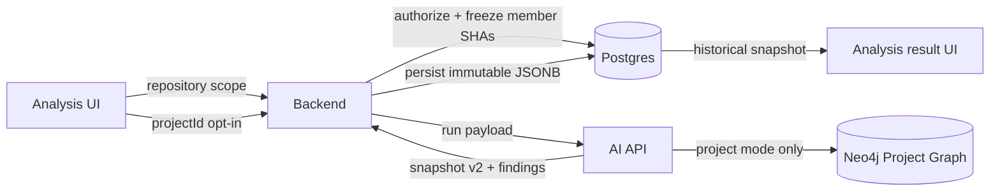

# Cross-Repo Impact Review — Technical Design

**Status:** Approved for implementation

**Date:** 2026-08-25
**Specification:** `spec.md`

## Architecture

The feature extends the existing review pipeline without changing its default path. The backend remains the authorization and scope-freezing control plane; the AI API computes deterministic contract deltas and graph impacts; the frontend exposes an opt-in selector and renders the persisted evidence.



## Key Decisions

1. `impactScope` is a discriminated optional input. Its absence is repository mode.
2. Repository mode never resolves projects and never queries Project Graph.
3. The backend authorizes and freezes project members before creating the analysis.
4. Changed-file context includes base and head content so removed contracts remain observable.
5. Contract matching is deterministic: normalized HTTP method + route, with conservative before/after pairing.
6. Neo4j queries are constrained to the frozen `(repoId, sha)` set.
7. Project failures are fail-open and produce a structured fallback snapshot while local reviewers continue.
8. Snapshot v2 preserves the existing local graph fields so historical and current renderers can coexist.
9. Cross-repo findings are generated from persisted evidence IDs. External files are report-only and cannot become inline PR comments.

## Backend Design

### Input

```ts
type ImpactScopeInput =
  | { mode: 'repository' }
  | { mode: 'project'; projectId: string };
```

`parseRunAnalysisBody` validates the discriminator, rejects extra `projectId` in repository mode and validates UUIDs in project mode.

### Eligibility

`GET /projects/eligible?repository=<owner/name>` returns only active projects owned by the authenticated user where the source repository is an active member and there are at least two active members. The response contains project identity, member count and index readiness only.

### Frozen scope

`ProjectsService.resolveAnalysisScope` returns:

- project ID/name;
- source repository membership;
- each active member's repository ID, indexed SHA, status, inclusion decision and omission reason;
- an initial `exact`, `degraded` or `fallback` state.

Only members with a usable indexed SHA are sent as query candidates. Stale indexes can be included but mark the result degraded. Missing, queued, indexing and failed indexes are recorded as omissions.

### Persistence

`analyses.impact_scope` is JSONB and stores the requested/effective scope summary independently of the full snapshot. This supports history badges even before or without loading the snapshot. The complete evidence remains in `analysis_context_snapshots`.

## AI API Design

### Contract delta

For every changed source file, endpoint extraction runs against both `baseContent` and `fullContent` (head). The matcher:

1. emits identical normalized contracts as `touched`;
2. pairs a remaining before/after contract only when file, role and stable symbol identity make the pairing unambiguous;
3. emits unmatched contracts as `removed` and `added`.

### Project traversal

The impact resolver builds bounded probes:

- changed provider → consumers in frozen secondary repositories;
- changed consumer → providers in frozen secondary repositories.

Exact method and normalized route are mandatory. Same-repository matches are discarded. Missing providers for new/modified consumers become unresolved `integration_gap` evidence.

### Classification

| Delta/relation | Risk |
| --- | --- |
| removed/modified provider with consumer | `breaking_candidate` |
| touched provider with consumer | `behavioral_candidate` |
| added/modified consumer without provider | `integration_gap` |
| other verified relation | `informational` |

Ordering is deterministic: risk priority, route, method, repository and path. Evidence is cut to the configured budget after sorting, and omissions are recorded.

### Snapshot v2

Snapshot v2 contains:

- requested/effective scope and fallback status;
- source base/head SHAs;
- included and omitted repository versions;
- contract changes, impacts and evidence;
- token/evidence budget and truncation;
- indexer/schema/query/extractor versions;
- rendered local and cross-repo context;
- canonical SHA-256 hash excluding only `createdAt` and `snapshotHash`.

The local graph snapshot remains embedded for backward-compatible visualization.

## Frontend Design

The analysis form adds an `Escopo da análise` card. It starts in local mode. Eligibility loads as a read-only preflight:

- no eligible project: toggle disabled with setup guidance;
- one eligible project: selected when enabled;
- multiple eligible projects: explicit selection required;
- index states and expected coverage are visible before run.

The historical result page renders a dedicated cross-repo section for v2 snapshots with scope status, frozen SHAs, contract changes, impacts, evidence and omissions. Snapshot v1 continues through the current local graph renderer. Analysis history shows a compact scope badge.

## Failure Handling

| Failure | Behavior |
| --- | --- |
| Invalid/unauthorized project | Reject before analysis persistence |
| Partial index coverage | Project mode, degraded status |
| No usable secondary index | Repository fallback, local analysis continues |
| Neo4j/query failure | Repository fallback, local analysis continues |
| One file extraction failure | Record omission, process remaining files |
| SSE resume | Reuse checkpoint and frozen scope; never resolve project again |

## Security

- Ownership and source membership are checked in the backend.
- AI receives only authorized repository IDs and frozen SHAs.
- Snapshots exclude GitHub tokens and model API keys.
- Error telemetry stores identifiers and safe reasons, not source content.

## Verification Strategy

- Backend unit/integration tests for parsing, eligibility, authorization, freezing and persistence.
- AI unit tests for deltas, traversal, budget, snapshot hashing and fail-open behavior.
- Frontend tests for default-off scope selection and v1/v2 rendering.
- Browser UAT for local, exact/degraded and historical evidence flows.
- Full backend, AI and frontend regression suites before handoff.
