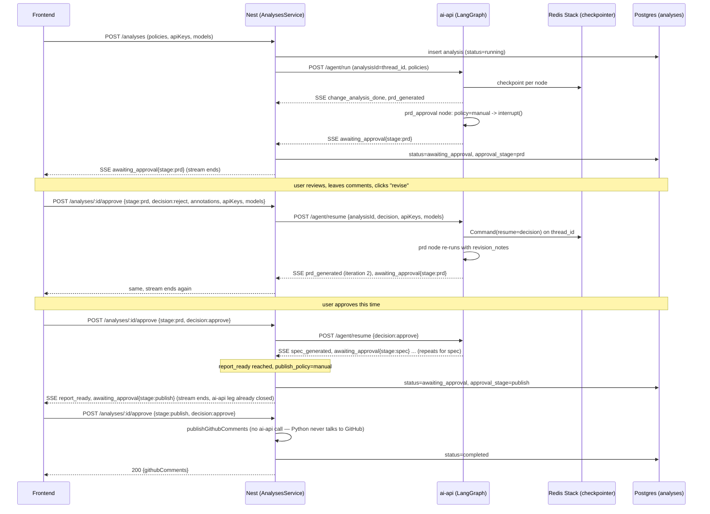

# Durable Runs + Multi-Stage HITL Gates Design

**Spec**: `.specs/features/durable-runs-hitl-gates/spec.md`
**Status**: Draft

---

## Architecture Overview

Today the whole pipeline (`change_analyzer → prd → implementation_spec → {test_reviewer, architecture_reviewer} → report_builder`) runs inside **one** HTTP request: Nest opens `POST /agent/run` to ai-api, keeps its own SSE response open for the entire run, and — still inside that same request — calls `publishGithubComments` right after `report_ready`. There is no checkpointer; `_graph = build_graph()` is a module-level singleton with no persistence (`apps/ai-api/app/graph/graph.py:11`, `pipeline.py:19`).

This design breaks that single-request model into **legs**. A leg is "start or resume the graph, stream until the next pause point (approval / completion / error)". Each leg is its own HTTP request/SSE stream on both sides:



Key structural point: **the `publish` gate never touches the Python graph.** In the current code, publishing already happens in Nest, *after* the graph has reached `END` (`analyses.service.ts:175`, called after `report_ready`). Gating it is just "don't call `publishGithubComments` automatically; wait for an approve call" — a Nest-only state machine on the existing `status` column. Only the `prd` and `spec` gates need a real LangGraph `interrupt()`, because those pauses happen *mid-graph*, between Python nodes that feed each other. This means Redis/checkpointer/interrupt machinery is scoped to 2 of the 3 stages, not 3 — smaller surface than PRD 05 assumed, because PRD 05 was written before checking where `publishGithubComments` actually lives.

---

## Research Notes (Context7-verified)

- Package: `langgraph-checkpoint-redis` (pip). Import: `from langgraph.checkpoint.redis.aio import AsyncRedisSaver`.
- Requires RedisJSON + RediSearch modules — bundled in `redis/redis-stack-server` image (or Redis ≥8.0 natively). Plain `redis:alpine` will not work.
- Usage: `async with AsyncRedisSaver.from_conn_string(url) as saver: await saver.asetup(); graph = builder.compile(checkpointer=saver)`. `asetup()` creates the RediSearch indices and is idempotent — call it once at startup.
- **Critical behavior, confirmed via LangGraph's own test suite**: a node containing `interrupt()` **re-executes from its own top on every resume** (verified: `call_count["ask_human"]` goes 1 → 2 across the initial hit and the resume). Any code in `human_approval` before the `interrupt()` call runs twice. The node must stay side-effect-free up to that call — no emitting, no writes.
- `Command(resume=<value>)` is passed as the `input` to `astream`/`ainvoke` with the same `config` (`thread_id`), replacing the normal `initial_state` input.
- **Uncertain, flag for Execute phase**: the exact shape of the interrupt marker under `stream_mode="updates"` (the codebase's current streaming mode) wasn't in the docs I could pull — Context7's examples use `.invoke()`, where the return dict carries `"__interrupt__"`. Verify empirically (a quick script hitting `astream(..., stream_mode="updates")` against a 1-node interrupt graph) before wiring `pipeline.py`'s event dispatch on it, rather than assuming the same key name applies unchanged to the streaming path.

---

## Code Reuse Analysis

### Existing Components to Leverage

| Component | Location | How to Use |
|---|---|---|
| `EVENT_BY_NODE` dispatch table + `astream(stream_mode="updates")` loop | `app/graph/pipeline.py` | Extend with `awaiting_approval` handling; same dispatch pattern, no new mechanism |
| `applyReviewEvent` / `emptyReview` / `hydrateReview` | `analyses/helpers/apply-review-event.ts` | Extend to handle `awaiting_approval` event, and repeated `prd_generated`/`spec_generated` (iteration overwrite + history append) |
| `AnalysesService.run()` streaming-proxy loop (thought persistence, `writeEvent`, `persistReview`) | `analyses.service.ts:104-200` | Extract into a shared private method reused by `run`, `resume`, `approve` (see Components) |
| `AiApiClient.runAgent` (fetch + SSE parse) | `ai-api.client.ts` | Add a second method `resumeAgent` hitting `/agent/resume`; both share `parseEvent` |
| `start_run`/`end_run`/`emit_thought` (`thoughts.py`) | ai-api | Unchanged — still keyed by `run_id`, which becomes `analysisId` |
| `buildAgentRunRequest` helper | `context-builder.helper.ts` | Extend to include `analysisId` and `policies` |

### Integration Points

| System | Integration Method |
|---|---|
| Postgres (`analyses` table) | New columns via migration (see Data Models) — same TypeORM repository pattern already in use |
| Redis Stack | New service in `docker-compose.yml`; only ai-api talks to it (Nest never touches Redis — durability is entirely LangGraph's concern, domain state stays in Postgres) |
| ai-api ↔ Nest contract | `AgentRunRequest` gains `analysisId`, `policies`; new `/agent/resume` endpoint mirrors `/agent/run`'s response shape (`AgentEvent` SSE stream) |

---

## Components

### `human_approval` node factory — `app/graph/nodes/human_approval.py` (new)

- **Purpose**: One factory producing the `prd_approval` and `spec_approval` graph nodes, parameterized by stage.
- **Interfaces**:
  - `make_approval_node(stage: Literal["prd", "spec"]) -> Callable[[GraphState, RunnableConfig], Awaitable[dict]]`
- **Behavior**:
  ```python
  def make_approval_node(stage):
      async def node(state: GraphState, config: RunnableConfig) -> dict:
          policy = config["configurable"]["policies"][stage]  # "manual" | "auto"
          if policy == "auto":
              return {"revision_notes": None, f"_{stage}_decision": "approve"}
          decision = interrupt({"stage": stage, "iteration": state.get(f"{stage}_iteration", 1)})
          if decision["action"] == "reject":
              return {"revision_notes": decision["annotations"], f"_{stage}_decision": "reject"}
          return {"revision_notes": None, f"_{stage}_decision": "approve"}
      return node
  ```
- **Dependencies**: `langgraph.types.interrupt`, per-run `policies` passed via `configurable` (not `GraphState` — policy is run configuration, not domain state)
- **Reuses**: nothing pre-existing (new concept), but mirrors PRD 05's original `human_approval` pseudocode

### Conditional routing — `app/graph/graph.py` (modified)

- **Purpose**: Loop `prd_approval`/`spec_approval` back to `prd`/`implementation_spec` on reject, forward on approve.
- **Interfaces**: `graph.add_conditional_edges("prd_approval", lambda s: s["_prd_decision"], {"approve": "implementation_spec", "reject": "prd"})` (same shape for `spec_approval`)
- **Dependencies**: `build_graph(checkpointer)` now takes the checkpointer as a parameter (was zero-arg) — call site moves from module level to `main.py`'s lifespan
- **Reuses**: existing node registration pattern in the same file

### `prd_node` / `implementation_spec_node` (modified, not new)

- **Purpose**: When `state.get("revision_notes")` is present, build a revision prompt (original content + notes) instead of a from-scratch prompt.
- **Location**: `app/graph/agents/prd.py`, `app/graph/agents/implementation_spec.py`
- **Note**: prompt-engineering detail belongs in Execute, not Design — the structural requirement is just "branch on presence of `revision_notes`".

### `pipeline.py` (modified)

- **Purpose**: Split into `run_pipeline` (fresh start) and `resume_pipeline` (continues a `thread_id`), both yielding `AgentEvent`. Both now take the compiled `graph` as a parameter instead of reading the module-level `_graph`.
- **Interfaces**:
  - `run_pipeline(graph, request: AgentRunRequest) -> AsyncIterator[AgentEvent]`
  - `resume_pipeline(graph, analysis_id: str, api_keys: ApiKeys, models: ReviewModels, policies: Policies, decision: ApprovalDecision | None) -> AsyncIterator[AgentEvent]`
- **New behavior**: after each `astream` chunk, check for the interrupt marker; on match, emit `AgentEvent(type="awaiting_approval", payload={"stage": ..., "iteration": ...})` and stop iterating (End of this leg — do not keep the generator or the underlying task alive waiting; the checkpoint already has everything needed for the next leg to pick up).
- **Reuses**: `EVENT_BY_NODE`, `start_run`/`end_run`, existing error handling

### `main.py` (modified) — checkpointer lifecycle

- **Purpose**: Own the `AsyncRedisSaver` lifetime and the compiled graph, via FastAPI lifespan.
- **Sketch**:
  ```python
  from contextlib import asynccontextmanager, AsyncExitStack
  from langgraph.checkpoint.redis.aio import AsyncRedisSaver

  @asynccontextmanager
  async def lifespan(app: FastAPI):
      async with AsyncExitStack() as stack:
          saver = await stack.enter_async_context(
              AsyncRedisSaver.from_conn_string(settings.REDIS_URL)
          )
          await saver.asetup()
          app.state.graph = build_graph(saver)
          yield

  app = FastAPI(title="Cast Review AI API", lifespan=lifespan)
  ```
- **Dependencies**: new `REDIS_URL` setting in `app/config/settings.py`

### `agent.py` routes (modified/new)

- `POST /agent/run` — unchanged shape, reads `request.app.state.graph` instead of the old module import
- `POST /agent/resume` (new) — body `AgentResumeRequest`, streams via `resume_pipeline`

### `AnalysesService` (modified) — Nest

- **Purpose**: Extract the streaming-proxy body (thought persistence, event application, publish-on-`report_ready`) out of `run()` into a shared method reusable across `run`, `resume`, `approve`.
- **New private method**: `private async streamLeg(analysis: Analysis, events: AsyncGenerator<AgentEvent>, res: Response): Promise<void>` — same loop as today's `run()` (`analyses.service.ts:147-202`), plus:
  - on `awaiting_approval` event → `persistReview({status: 'awaiting_approval', approvalStage: payload.stage})`, write event, **return** (do not continue the loop — mirrors today's early-return-shaped `report_ready` branch, generalized)
  - on `report_ready` → same as today, **except** publishing is now gated: if `publishPolicy.publish === 'manual'` (or `auto_safe` and the safety check fails — reuses PRD 04's guardrail/verdict check, out of this feature's scope to build but the branch point is here) → set `awaiting_approval`/`approval_stage='publish'` and return *without* calling `publishGithubComments`; otherwise call it exactly as today.
- **New public methods**:
  - `resume(analysisId, currentUser, {apiKeys, models}, req, res)` — loads the analysis (must belong to user, status `running`/`error`), calls `aiApiClient.resumeAgent({analysisId, apiKeys, models, policies: analysis.publishPolicy, decision: null})`, opens SSE, delegates to `streamLeg`
  - `approve(analysisId, currentUser, body: ApproveDto, req, res?)` — branches on `body.stage`:
    - `stage === 'publish'`: no ai-api call. `decision === 'reject'` → mark `error` (irreversible action, spec HITL rule 5 style — rejecting a ready-to-publish report just stops here, no revision loop for publish). `decision === 'approve'` → call `publishGithubComments` directly, `persistReview({status:'completed', ...})`, return plain JSON (no SSE needed, it's instantaneous)
    - `stage in ('prd','spec')`: validate `decision==='reject' → annotations.length >= 1` (else 400, spec HITL-04 criterion 3). Calls `aiApiClient.resumeAgent({analysisId, apiKeys, models, policies, decision: {stage, action: decision, annotations}})`, opens SSE, delegates to `streamLeg`, and on the iteration bump appends `{content, annotations, createdAt}` to `prdIterations`/`specIterations` before overwriting the "current" value

### `AnalysesController` (modified) — Nest

- New routes: `POST /analyses/:id/resume`, `POST /analyses/:id/approve`

### `AiApiClient` (modified) — Nest

- New method `resumeAgent(payload: AgentResumeRequest, signal): AsyncGenerator<AgentEvent>` — identical shape to `runAgent`, POSTs to `/agent/resume`, reuses `parseEvent`

---

## Data Models

### `Analysis` entity — new/changed columns

```typescript
// analysis.entity.ts additions
@Column({ type: 'varchar' })
status: AnalysisStatus; // 'running' | 'awaiting_approval' | 'completed' | 'error'

@Column({ name: 'approval_stage', type: 'varchar', nullable: true })
approvalStage: 'prd' | 'spec' | 'publish' | null;

@Column({ name: 'publish_policy', type: 'jsonb' })
publishPolicy: { prd: 'manual' | 'auto'; spec: 'manual' | 'auto'; publish: 'manual' | 'auto_safe' | 'auto' };

@Column({ name: 'prd_iterations', type: 'jsonb', default: () => "'[]'" })
prdIterations: Array<{ content: Record<string, unknown>; annotations: Annotation[] | null; createdAt: string }>;

@Column({ name: 'spec_iterations', type: 'jsonb', default: () => "'[]'" })
specIterations: Array<{ content: Record<string, unknown>; annotations: Annotation[] | null; createdAt: string }>;

@Column({ name: 'resumed_count', type: 'int', default: 0 })
resumedCount: number;
```

**Deviation from PRD 05**: skipping the separate `thread_id` column PRD 05 proposed. It would always equal `id` 1:1 — no case exists where they'd diverge (single ai-api process, no multi-tenant thread reuse in scope) — so it's a redundant column, not a real degree of freedom. `analysis.id` is passed as `thread_id` directly.

**Annotation shape** (used in request bodies and stored in iterations):
```typescript
interface Annotation {
  excerpt: string;  // must match a substring of the content being annotated (validated server-side)
  note: string;
}
```

### `GraphState` — changes

```python
class GraphState(TypedDict, total=False):
    run_id: str
    diff: str
    changed_files: list[dict]
    conventions: str
    models: dict[str, str]
    # api_keys REMOVED — moves to `configurable`, never checkpointed (PRD 05's mandatory refactor, still applies)
    change_analysis: dict[str, Any]
    prd: dict[str, Any]
    spec: dict[str, Any]
    test_review: dict[str, Any]
    architecture_review: dict[str, Any]
    report: dict[str, Any]
    revision_notes: list[dict] | None       # new — annotations for the node about to re-run
    prd_iteration: int                       # new — starts at 1, incremented on each reject loop
    spec_iteration: int                      # new
```

### ai-api schemas (`schemas.py`) — changes

```python
class Policies(BaseModel):
    prd: Literal["manual", "auto"] = "manual"
    spec: Literal["manual", "auto"] = "manual"

class AgentRunRequest(BaseModel):
    analysisId: str          # new — becomes thread_id
    diff: str
    changedFiles: list[ChangedFileContext]
    conventions: str = ""
    models: ReviewModels
    apiKeys: ApiKeys
    policies: Policies       # new

class Annotation(BaseModel):
    excerpt: str
    note: str

class ApprovalDecision(BaseModel):
    stage: Literal["prd", "spec"]
    action: Literal["approve", "reject"]
    annotations: list[Annotation] | None = None

class AgentResumeRequest(BaseModel):
    analysisId: str
    models: ReviewModels
    apiKeys: ApiKeys
    policies: Policies
    decision: ApprovalDecision | None = None   # None = plain reconnect after crash

AgentEventType = Literal[
    "change_analysis_done", "prd_generated", "spec_generated",
    "test_reviewer_done", "architecture_reviewer_done", "report_ready",
    "awaiting_approval",   # new
    "thought", "error",
]
```

---

## Error Handling Strategy

| Error Scenario | Handling | User Impact |
|---|---|---|
| Redis unreachable at ai-api startup | Lifespan raises, FastAPI fails to boot | ai-api container won't come up — loud failure, matches spec's "no silent durability downgrade" edge case |
| Stale annotation (`excerpt` no longer found in current content) | Nest validates before calling ai-api resume; 400 with the mismatched excerpt | User re-selects against the current version |
| `reject` decision with empty `annotations` | Nest DTO validation; 400 | Blocked before any ai-api call, no wasted token |
| `resume`/`approve` called on an analysis not in `running`/`error`/`awaiting_approval` | 409 Conflict | Frontend hides the action for terminal states |
| ai-api graph interrupted but Nest's process died before persisting `awaiting_approval` status | Cleanup job (P2, HITL-07) eventually times the row out at 24h if nobody ever calls `approve`; a plain GET on the analysis + manual "check ai-api state" reconciliation is out of scope for v1 | Worst case: user sees stale `running` until the 24h cleanup fires — acceptable per spec's P2 sizing |
| `api_keys` accidentally end up in a checkpoint | CI test serializes a checkpoint and asserts no `api_keys`/`openai` key substring present (ports PRD 05's risk mitigation forward) | N/A — caught pre-merge |

---

## Tech Decisions

| Decision | Choice | Rationale |
|---|---|---|
| Checkpointer backend | Redis Stack (`langgraph-checkpoint-redis`, `AsyncRedisSaver`) instead of PRD 05's `AsyncPostgresSaver` | User's explicit choice for portfolio breadth; verified via Context7 that it needs RedisJSON+RediSearch (Redis Stack image), not plain Redis |
| Redis durability config | `appendonly yes`, `maxmemory-policy noeviction` | Checkpoint data is durable execution state, not a cache — default Redis (TTL/eviction under memory pressure) would reintroduce the exact bug this feature fixes, silently |
| Publish gate implementation | Pure Nest state machine on the existing `status` column — no Python graph node | `publishGithubComments` already runs in Nest, after the graph reaches `END`. Adding a Python `interrupt()` node for it would mean Nest calling back into ai-api for a step that does nothing but ask a question Nest can ask itself. Simpler, smaller surface, same architecture boundary already in place |
| `prd`/`spec` gate implementation | Real LangGraph `interrupt()`, mid-graph | These pauses sit between Python nodes whose output feeds the next Python node — genuinely mid-execution, unlike publish |
| Edit-and-reprocess loop | Conditional edge back to the originating node (`prd_approval → prd`, `spec_approval → implementation_spec`), state carries `revision_notes` | Matches LangGraph's own idiom (interrupt node's re-execution-on-resume is unavoidable per the framework; looping back to the *content* node for a real regeneration is the natural extension of that, not a workaround) |
| Iteration history storage | Postgres (`prd_iterations`/`spec_iterations` jsonb arrays on `analyses`), not Redis | Redis holds LangGraph's internal execution checkpoint — opaque, not meant for arbitrary domain queries/UI reads. Iteration history is domain data the frontend needs to list/display, which is exactly what the Postgres/TypeORM side is for |
| `auto_safe` policy scope | Stays exclusive to `publish` | No objective signal (verdict, guardrail severity) exists for `prd`/`spec` yet; inventing a completeness heuristic was explicitly descoped in Discuss |
| `thread_id` column | Dropped vs. PRD 05's proposal | Always equal to `analysis.id`; redundant column with no independent degree of freedom in this design |

---

## Open Items for Execute Phase

1. Verify the exact interrupt-chunk shape under `stream_mode="updates"` empirically (flagged uncertain above) before writing `pipeline.py`'s dispatch logic.
2. Confirm `redis/redis-stack-server`'s exact env-var name for passing `--appendonly yes --maxmemory-policy noeviction` (likely `REDIS_ARGS`, standard for that image, but verify against the image's current docs when writing the compose entry).
3. `auto_safe` for `publish` depends on PRD 04's guardrail severity signal — if PRD 04 isn't implemented yet, `auto_safe` degrades to behaving like `manual` (documented fallback, not a blocker for this feature).
