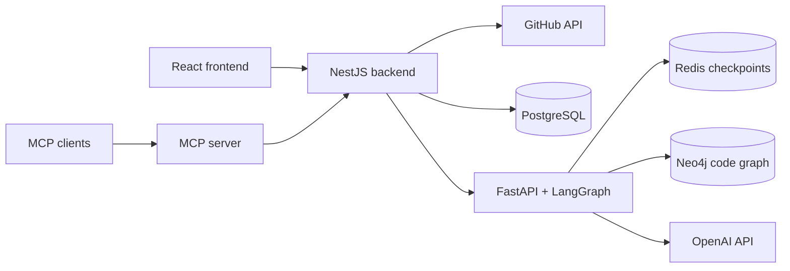

# Cast Review

**Context-aware AI review for GitHub pull requests.**

Cast Review combines a structural code graph with a staged review pipeline. Each finding can carry an exact source excerpt; the application derives its line from the repository content and posts it to GitHub only when that exact line is part of the PR diff.

## Explore the demo

On an instance with guest access enabled, select **Entrar como visitante** on the login page, then open **Benchmarks**. The official cases and their frozen diffs and context can be browsed without a GitHub token or model API key. Browsing those cases does not call a model. Running a review requires credentials supplied by the user.

For a shared demo deployment, configure:

```env
DEMO_LOGIN=true
CREDENTIALS_MODE=ephemeral
DEMO_SESSION_TTL_MINUTES=120
```

Guest records carry a TTL; expired records are reclaimed when a new guest session is created. In ephemeral credential mode, GitHub and model credentials stay in the active browser session instead of being stored by the application. The repository does not include a hosted demo URL.

## What to look at

- **Review pipeline:** LangGraph stages produce a PR summary, implementation spec, test review, architecture review, and a deterministic verdict.
- **Structural context:** Tree-sitter indexes Python, JavaScript, and TypeScript code into a graph used to select changed symbols, callers, callees, and tests.
- **Auditable runs:** analyses preserve the graph context snapshot, repository SHA, selection details, and budget information used for the review.
- **Evidence-checked locations:** test and architecture reviewers return a literal code excerpt. The AI API derives its unique line in the changed file, and the backend checks the excerpt against the latest GitHub patch before posting. Findings without a verifiable quote or exact patch match stay in the report.
- **Prompt boundary:** reviewer prompts tell agents to treat diffs, source files, comments, PRDs, specs, and repository conventions as analysis data, and to ignore embedded instructions that try to change their role or output schema. This is defense in depth, not a security guarantee; adversarial evaluation is still open.
- **Benchmark Lab:** compare models on the same frozen case and inspect findings, cost, and duration.
- **MCP server:** exposes repository indexing and analysis capabilities to MCP clients.

## Architecture



The NestJS backend owns accounts, GitHub access, persistence, indexing jobs, and comment publication. The Python service owns code analysis and model calls. The MCP server offers a tool interface over these capabilities.

## Run locally

Requirements: Node.js 24, Python 3.12, Docker, and a Neo4j GDS plugin available to the local Neo4j container.

Before starting Neo4j, put a Graph Data Science plugin JAR compatible with the Neo4j image in `.neo4j-plugins/`; the Compose file mounts that folder into the container. The plugin is a local dependency and is not committed. See Neo4j's [Docker plugin guide](https://neo4j.com/docs/operations-manual/current/docker/plugins/) and [GDS compatibility table](https://neo4j.com/docs/graph-data-science/current/installation/supported-neo4j-versions/).

Start the data services:

```sh
docker compose up -d postgres redis neo4j
```

Copy `apps/backend/.env.example` to `apps/backend/.env` and fill its local secrets and database settings. The defaults in the example target the included Postgres container. In one terminal, start the AI API:

```sh
cd apps/ai-api
python -m venv .venv
source .venv/bin/activate
pip install -r requirements.txt
uvicorn app.main:app --reload --port 8000
```

In another terminal, migrate and start the backend:

```sh
cd apps/backend
npm ci
npm run migration:run
npm run start:dev
```

In a third terminal, start the frontend:

```sh
cd apps/frontend
npm ci
npm run dev
```

Open `http://localhost:5173`. Register an account, connect GitHub, and add an OpenAI key in Settings to run a review. To enable temporary guest login locally, set `DEMO_LOGIN=true` and `CREDENTIALS_MODE=ephemeral` in the backend environment.

## Evaluation status

The Benchmark Lab currently includes eight curated public PR cases. They are marked **exploratory** and have no adjudicated ground truth, so comparisons show model differences, cost, and duration; they do not claim precision, recall, or an accuracy ranking. See the [case fixtures](apps/backend/src/modules/benchmarks/fixtures/curated-benchmark-cases.ts) and [benchmark plan](docs/feature-analysis-context-benchmark/PRD.md).

## Project notes

- [Backend architecture](docs/ARCHITECTURE-backend.md)
- [Frontend architecture](docs/ARCHITECTURE-frontend.md)
- [Inline comment location contract](docs/feature-implement-github-comments/SPEC.md)
- [Code graph context design](docs/feature-code-graph-context/ADR.md)
- [Quality workflow](.github/workflows/quality.yml)

This is a portfolio project. The production-readiness notes document operational work that is still open; the local demo setup should not be read as a production deployment guide.
