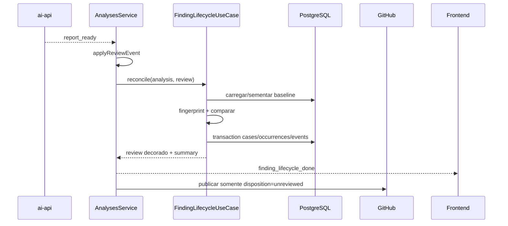

# SPEC: Ciclo de vida dos findings

**Status:** Draft técnico

**Data:** 2026-09-01

**PRD:** [PRD.md](./PRD.md)

## 1. Objetivo técnico

Adicionar uma camada determinística no NestJS que, depois de receber `report_ready`, reconcilia findings acionáveis com casos anteriores da mesma PR, persiste ocorrências e transições, decora o relatório com lifecycle e controla quais findings podem ser republicados no GitHub.

O `ai-api` continua responsável por produzir findings. Ele não conhece histórico, decisões humanas ou banco relacional. O Nest continua sendo a fronteira de persistência e GitHub.

## 2. Decisões travadas

| ID | Decisão | Justificativa |
| --- | --- | --- |
| D1 | Lifecycle vive no `AnalysesModule` do Nest | É estado de produto, não raciocínio do agente |
| D2 | Escopo P1 é `user + owner + repo + pullNumber` | Evita aplicar uma decisão contextual a outra PR ou usuário |
| D3 | Somente `fail` e `warning` geram cases | `pass` não requer acompanhamento nem feedback |
| D4 | Matching é determinístico e versionado | Permite teste, auditoria e replay sem custo de LLM |
| D5 | Ausência gera `not_observed`, não “fixed” | O sistema não prova correção do código |
| D6 | Estado automático e disposição humana são dimensões independentes | Preserva história mesmo quando o caso some e volta |
| D7 | Disposição não recalcula score/veredito | O relatório histórico continua fiel ao output original |
| D8 | `accepted_risk` e `false_positive` suprimem republicação futura | Reduz fadiga sem apagar informação interna |
| D9 | Reconciliação é fail-open | Falha auxiliar não invalida a review já gerada |
| D10 | API REST aditiva, com cursor; disposição usa `PUT` idempotente | Compatível com o frontend e segura para retry |
| D11 | Baseline histórico é semeado sob demanda e limitado à análise anterior | Entrega valor imediato sem backfill amplo em migration |

## 3. Arquitetura



### Fronteiras

- **Python:** nenhuma alteração obrigatória no P1.
- **Nest `AnalysesModule`:** identidade da análise, reconciliação, leitura contextual e publicação.
- **Nest `FindingCasesModule`:** entidades, repositórios, disposição humana e sua rota HTTP.
- **Frontend:** filtros, badges, ações de disposição e estado indisponível.
- **GitHub publisher:** filtra findings reconhecidos, mas não altera o relatório ou o score.

## 4. Fluxo de reconciliação

### 4.1 Momento

Em `AnalysesService.streamLeg`, depois de `applyReviewEvent(..., 'report_ready', ...)` e antes de persistir/publicar comentários:

1. chamar `FindingLifecycleUseCase.reconcile` pela fachada `AnalysesService`;
2. anexar `findingLifecycle` ao `AnalysisReview`;
3. persistir o relatório decorado;
4. emitir `finding_lifecycle_done` pelo SSE do Nest;
5. publicar no GitHub apenas ocorrências elegíveis;
6. se a reconciliação falhar, persistir `findingLifecycle.status = 'unavailable'`, logar IDs e continuar.

O mesmo ponto deve ser usado tanto no fluxo automático quanto no fluxo que aguarda aprovação de publicação. Aprovar a publicação não deve reconciliar novamente.

Antes de montar comentários, tanto a publicação automática quanto a aprovação manual devem reler no PostgreSQL a disposição atual de todos os `caseId` presentes no relatório. A cópia embutida no report serve à visualização histórica daquela execução, mas não é a autoridade para uma decisão que pode ter mudado entre `report_ready` e `approve`.

### 4.2 Comparabilidade

Um case só pode ser marcado `not_observed` quando:

- a análise atual chegou a `report_ready`;
- o `ReviewResult.name` que originou o case existe em `report.results` da análise atual;
- a ocorrência atual e o case pertencem ao mesmo escopo P1;
- a reconciliação atual não foi marcada como incompleta.

Mudança de modelo não impede a comparação, mas `comparison.modelChanged = true` deve ser exposto quando os modelos persistidos diferirem do baseline. A UI mostra esse aviso sem mudar a classificação.

### 4.3 Algoritmo

Para cada finding acionável atual:

1. calcular `fingerprintV1` e `matchBasis`;
2. buscar case pela chave única de escopo + fingerprint;
3. sem case: criar case `active`, criar ocorrência `new` e evento `first_seen`;
4. case `active`: atualizar `lastSeenAnalysisId`, criar ocorrência `recurring` e evento `seen_again`;
5. case `resolved`: mudar para `active`, incrementar `reopenedCount`, criar ocorrência `reopened` e evento `reopened`;
6. preservar a disposição existente em todos os caminhos.

Depois de processar os findings atuais:

7. para cada case `active` do escopo cujo reviewer concluiu e que não foi observado, mudar para `resolved`, definir `resolvedInAnalysisId` e criar evento `not_observed`;
8. gerar o summary da análise;
9. executar tudo em uma única transação PostgreSQL.

Antes de formar a chave de escopo, owner e repo são resolvidos para a identidade canônica do GitHub e normalizados em lowercase. O owner vazio aceito por análises históricas nunca é usado diretamente como chave de case.

### 4.4 Idempotência

- `finding_occurrences` tem unique `(case_id, analysis_id)`.
- `finding_case_events` tem unique `(case_id, analysis_id, type)` para eventos automáticos.
- Reexecutar `reconcile` para a mesma análise deve retornar o estado persistido sem criar duplicatas.
- O `PUT` de disposição é no-op quando disposição e nota já possuem o mesmo valor normalizado.

## 5. Fingerprint v1

### 5.1 Normalização comum

```text
reviewer = trim(lower(reviewer))
path = normalizeRepoPath(path ?? "")
title = collapseWhitespace(lower(title))
stableAnchor = firstNonEmpty(evidenceId, conventionRef, businessRule)
```

Não participam da identidade:

- severidade;
- `detail`;
- números de linha;
- score;
- modelo;
- texto integral do arquivo.

### 5.2 Material

Quando existir âncora estável:

```text
v1|reviewer|path|stable:<normalized stableAnchor>
matchBasis = stable_anchor
```

Quando não existir:

```text
v1|reviewer|path|title:<normalized title>
matchBasis = title_fallback
```

O fingerprint persistido é `sha256(material)`. O `material` também é persistido sem conteúdo de código para auditoria.

### 5.3 Restrições

- O fallback de título é exato depois da normalização; não há fuzzy matching.
- Finding sem `path` pode formar case, mas o risco de colisão é reduzido por reviewer + âncora/título.
- Duplicatas com o mesmo fingerprint dentro da mesma análise são agregadas numa ocorrência; a ocorrência conserva `sourceCount` e snapshots dos itens originais.
- Alterar o algoritmo exige nova `fingerprintVersion`; cases de versões diferentes não se misturam automaticamente.

## 6. Modelo de dados

### 6.1 `finding_cases`

```typescript
type FindingCaseState = 'active' | 'resolved';
type FindingDisposition = 'unreviewed' | 'accepted_risk' | 'false_positive';
type FindingMatchBasis = 'stable_anchor' | 'title_fallback';

interface FindingCase {
  id: string;
  requestedBy: string;
  owner: string;              // normalizado para lowercase
  repo: string;               // normalizado para lowercase
  pullNumber: number;
  reviewer: string;
  fingerprintVersion: '1';
  fingerprint: string;
  fingerprintMaterial: string;
  matchBasis: FindingMatchBasis;
  state: FindingCaseState;
  disposition: FindingDisposition;
  dispositionNote: string | null;
  firstSeenAnalysisId: string | null;
  lastSeenAnalysisId: string | null;
  resolvedInAnalysisId: string | null;
  reopenedCount: number;
  createdAt: Date;
  updatedAt: Date;
}
```

Índices:

- unique `(requested_by, owner, repo, pull_number, fingerprint_version, fingerprint)`;
- `(requested_by, owner, repo, pull_number, state, disposition)`;
- `(last_seen_analysis_id)`.

FKs de análise usam `ON DELETE SET NULL`; ocorrências e eventos preservam o vínculo histórico enquanto a análise existir.

### 6.2 `finding_occurrences`

```typescript
type FindingClassification = 'new' | 'recurring' | 'reopened';

interface FindingOccurrence {
  id: string;
  caseId: string;
  analysisId: string;
  classification: FindingClassification;
  severity: 'fail' | 'warning';
  reviewer: string;
  title: string;
  detail: string;
  businessRule: string | null;
  conventionRef: string | null;
  evidenceId: string | null;
  path: string | null;
  line: number | null;
  endLine: number | null;
  sourceCount: number;
  createdAt: Date;
}
```

Índices/FKs:

- unique `(case_id, analysis_id)`;
- `(analysis_id, classification, created_at, id)` para paginação;
- case e analysis com `ON DELETE CASCADE`.

### 6.3 `finding_case_events`

```typescript
type FindingCaseEventType =
  | 'first_seen'
  | 'seen_again'
  | 'reopened'
  | 'not_observed'
  | 'disposition_changed';

interface FindingCaseEvent {
  id: string;
  caseId: string;
  analysisId: string | null;
  actorId: string | null; // null para transição automática
  type: FindingCaseEventType;
  payload: Record<string, unknown>;
  createdAt: Date;
}
```

Para `disposition_changed`, `payload` contém somente valores anterior/novo e nota; nunca conteúdo de código.

Índices:

- `(case_id, created_at, id)`;
- unique parcial lógico para eventos automáticos `(case_id, analysis_id, type)` quando `analysis_id IS NOT NULL`.

## 7. Contratos de domínio e relatório

### 7.1 Metadado por finding observado

```typescript
interface FindingLifecycleMeta {
  caseId: string;
  classification: 'new' | 'recurring' | 'reopened';
  state: 'active';
  disposition: 'unreviewed' | 'accepted_risk' | 'false_positive';
  matchBasis: 'stable_anchor' | 'title_fallback';
  firstSeenAnalysisId: string;
  previousOccurrenceAnalysisId: string | null;
}

interface ReviewComment {
  // campos existentes
  lifecycle?: FindingLifecycleMeta;
}
```

### 7.2 Resumo no relatório

```typescript
interface FindingLifecycleSummary {
  status: 'available' | 'unavailable';
  baselineAnalysisId: string | null;
  modelChanged: boolean;
  newCount: number;
  recurringCount: number;
  reopenedCount: number;
  notObservedCount: number;
  acknowledgedCount: number;
  suppressedFromGithubCount: number;
  errorCode?: 'reconciliation_failed';
}

interface AnalysisReview {
  // campos existentes
  findingLifecycle?: FindingLifecycleSummary;
}
```

### 7.3 Evento SSE originado no Nest

```json
{
  "type": "finding_lifecycle_done",
  "payload": {
    "status": "available",
    "baselineAnalysisId": "uuid-ou-null",
    "modelChanged": false,
    "newCount": 2,
    "recurringCount": 1,
    "reopenedCount": 0,
    "notObservedCount": 3,
    "acknowledgedCount": 1,
    "suppressedFromGithubCount": 1
  }
}
```

Clientes antigos ignoram o novo tipo. O `ai-api` não emite nem consome este evento.

## 8. API HTTP

As rotas seguem o prefixo atual do controller, sem introduzir `/v1`. A evolução P1 é somente aditiva.

### 8.1 Listar lifecycle de uma análise

```http
GET /analyses/{analysisId}/finding-lifecycle?view=attention&limit=50&cursor=opaque
Authorization: Bearer <jwt>
```

Parâmetros:

| Campo | Valores | Default | Regra |
| --- | --- | --- | --- |
| `view` | `attention`, `acknowledged`, `not_observed`, `all` | `attention` | filtro fechado |
| `limit` | 1–100 | 50 | valores acima retornam 400 |
| `cursor` | string opaca | ausente | codifica sort key + id, assinada/versionada |

Resposta `200`:

```json
{
  "data": [
    {
      "caseId": "uuid",
      "classification": "recurring",
      "state": "active",
      "disposition": "unreviewed",
      "dispositionNote": null,
      "matchBasis": "stable_anchor",
      "firstSeenAnalysisId": "uuid",
      "previousOccurrenceAnalysisId": "uuid",
      "currentOccurrence": {
        "severity": "fail",
        "reviewer": "test_reviewer",
        "title": "Regra sem teste",
        "detail": "...",
        "path": "src/x.ts",
        "line": 42,
        "endLine": null,
        "businessRule": "...",
        "conventionRef": null,
        "evidenceId": null
      },
      "transitionedAt": "2026-09-01T18:00:00.000Z"
    }
  ],
  "summary": {
    "status": "available",
    "baselineAnalysisId": "uuid",
    "modelChanged": false,
    "newCount": 2,
    "recurringCount": 1,
    "reopenedCount": 0,
    "notObservedCount": 3,
    "acknowledgedCount": 0,
    "suppressedFromGithubCount": 0
  },
  "nextCursor": null,
  "hasMore": false
}
```

Para `not_observed`, `currentOccurrence` é `null` e a resposta inclui `lastOccurrence`.

Ordenação estável:

1. `reopened`;
2. `new`;
3. `recurring`;
4. `not_observed`;
5. severidade `fail` antes de `warning`;
6. `transitionedAt DESC, caseId DESC`.

O cursor codifica versão, view, último rank, timestamp e caseId. Cursor de outra view retorna `400`.

### 8.2 Atualizar disposição

```http
PUT /finding-cases/{caseId}/disposition
Authorization: Bearer <jwt>
Content-Type: application/json
```

```json
{
  "disposition": "accepted_risk",
  "note": "Compatibilidade mantida até a migração do consumidor."
}
```

Regras:

- `note` aceita `null` ou texto de 1–500 caracteres depois de trim;
- `false_positive` exige nota no MVP;
- `accepted_risk` permite nota nula, mas a UI recomenda justificativa;
- `unreviewed` limpa a nota atual;
- mesma disposição + mesma nota normalizada retorna `200` sem criar novo evento;
- case de outro usuário retorna `404`, não `403`.

Resposta `200`:

```json
{
  "id": "uuid",
  "state": "active",
  "disposition": "accepted_risk",
  "dispositionNote": "Compatibilidade mantida até a migração do consumidor.",
  "updatedAt": "2026-09-01T18:10:00.000Z"
}
```

Como `PUT` define o estado final do recurso e repetição idêntica é no-op, não é necessário `Idempotency-Key` no P1.

### 8.3 Erros

Mantém o envelope Nest existente:

```json
{
  "statusCode": 400,
  "message": "cursor inválido",
  "error": "Bad Request"
}
```

| Cenário | Status |
| --- | --- |
| Analysis/case inexistente ou de outro usuário | 404 |
| View, cursor, limit ou body inválido | 400 |
| Lifecycle indisponível para analysis | 409 |
| Concorrência otimista não resolvida após retry interno | 409 |
| Rate limit futuro | 429 + `Retry-After` |

## 9. Concorrência e consistência

- A reconciliação usa transação e lock por escopo lógico da PR.
- Duas análises da mesma PR podem terminar fora de ordem; a ordem de lifecycle é `createdAt` da análise, não o instante de término.
- Antes de reconciliar, o serviço verifica se existe análise posterior já reconciliada. Se existir, a análise atrasada é persistida como ocorrência histórica, mas não pode retroceder o estado atual dos cases; um job de recomputação P2 fica fora do MVP.
- Atualização de disposição usa `updatedAt` como controle otimista interno. Um conflito é relido e tentado uma vez.

## 10. Baseline sob demanda

Quando não existem cases para o escopo:

1. buscar a análise `completed` imediatamente anterior, com `report.comments` válido;
2. processá-la como seed sem emitir SSE nem publicar GitHub;
3. criar seus cases/occurrences/events com a classificação histórica `new`;
4. reconciliar a análise atual normalmente;
5. se não houver análise anterior, a atual vira primeira baseline.

O seed é idempotente. Análises anteriores à imediatamente anterior permanecem fora do lifecycle P1.

## 11. Publicação no GitHub

`publishGithubComments` carrega as disposições atuais dos cases referenciados no relatório e entrega esse mapa ao filtro de publicação:

```typescript
function collectPublishable(
  review: AnalysisReview,
  currentDispositionByCaseId: ReadonlyMap<string, FindingDisposition>,
): ReviewerComment[] {
  return review.comments.filter((item) =>
    (item.status === 'fail' || item.status === 'warning') &&
    !isAcknowledged(
      item.lifecycle?.caseId
        ? currentDispositionByCaseId.get(item.lifecycle.caseId)
        : undefined,
    )
  );
}
```

Regras adicionais:

- Findings sem metadata por lifecycle indisponível continuam publicáveis para preservar o comportamento atual.
- O PostgreSQL é a autoridade para disposição no instante da publicação; o valor decorado no report não decide sozinho.
- O body do review inclui `N finding(s) reconhecido(s) não republicado(s)` quando `N > 0`.
- O marcador de comentário existente continua baseado em `analysisId`.
- Alterar disposição depois que um comentário foi publicado não apaga retroativamente o comentário no P1.

## 12. Frontend

### Componentes

| Componente | Responsabilidade |
| --- | --- |
| `FindingLifecycleSummary` | chips de delta e aviso de baseline/modelo |
| `FindingLifecycleFilters` | attention/acknowledged/not_observed/all |
| `FindingDispositionMenu` | ação e nota com estados de loading/error |
| `FindingLifecycleBadge` | novo/recorrente/reaberto/não observado |
| `FindingCard` existente | passa a aceitar metadata e ações |

### Comportamento

- `ReportView` continua exibindo relatórios antigos sem qualquer placeholder obrigatório.
- Quando `findingLifecycle.status = unavailable`, mostra aviso discreto e usa a lista atual sem classificação.
- A UI faz update otimista de disposição e reverte em falha.
- `false_positive` abre campo de justificativa obrigatório.
- `not_observed` mostra o snapshot da última ocorrência e o texto “não reapareceu nesta análise”.
- Troca de modelo entre baseline e atual mostra aviso sem invalidar a comparação.

## 13. Arquivos previstos

### Backend — novos

- `apps/backend/src/modules/finding-cases/finding-case.entity.ts`
- `apps/backend/src/modules/finding-cases/finding-occurrence.entity.ts`
- `apps/backend/src/modules/finding-cases/finding-case-event.entity.ts`
- repositories correspondentes;
- `finding-cases/use-cases/finding-lifecycle/finding-lifecycle.use-case.ts`;
- `helpers/finding-fingerprint.helper.ts`;
- `FindingCasesModule`, service e controller;
- use-case e DTO `finding-cases/use-cases/update-finding-disposition/`;
- migration `CreateFindingLifecycle`.

### Backend — alterados

- `analyses.module.ts`;
- `analyses.controller.ts` para a leitura por análise;
- `analyses.service.ts`;
- `analyses.types.ts`;
- `helpers/github-review.helper.ts`;
- `postgres.datasource.ts`;
- `shared/types.ts` para o evento SSE.

### Frontend

- `src/types/index.ts`;
- `src/api/analyses.api.ts`;
- `src/components/analysis/ReportView.tsx`;
- novos componentes de lifecycle.

### Python

- nenhum arquivo obrigatório no P1.

## 14. Testes

### Unitários determinísticos

- fingerprint ignora severidade, detalhe, linha e modelo;
- fingerprint usa âncoras na ordem definida;
- normalização de path/texto;
- duplicatas numa análise são agregadas;
- matriz de transição `new/recurring/reopened/not_observed`;
- reviewer ausente não resolve;
- disposição é preservada ao reabrir;
- filtro de publicação suprime reconhecidos.

### Integração Nest/Postgres

- transação cria case, occurrence e event atomicamente;
- rerun da mesma analysis não duplica;
- seed da baseline anterior ocorre uma vez;
- concorrência de duas analyses da mesma PR mantém constraints;
- ownership retorna 404;
- paginação por cursor não duplica nem omite entre páginas estáveis;
- `PUT` idêntico é no-op no histórico.

### E2E

1. rodar análise A com findings X/Y;
2. rodar B com X/Z e verificar X recorrente, Z novo, Y não observado;
3. marcar X como falso positivo;
4. rodar C com X/Y e verificar X suprimido, Y reaberto;
5. forçar falha da reconciliação e verificar review concluída com status unavailable.

### Frontend

- filtros e contadores;
- ação otimista com rollback;
- acessibilidade do menu/modal;
- fallback para análise histórica sem lifecycle;
- copy nunca usa “corrigido” para `not_observed`.

## 15. Observabilidade

Métricas sem conteúdo sensível:

- `finding_lifecycle_reconcile_duration_ms`;
- `finding_lifecycle_cases_total{classification}`;
- `finding_lifecycle_dispositions_total{disposition}`;
- `finding_lifecycle_suppressed_github_total`;
- `finding_lifecycle_reconcile_failures_total{code}`;
- `finding_lifecycle_match_basis_total{basis}`.

Logs incluem `analysisId`, `caseId`, contagens e fingerprint version; não incluem fingerprint material, título, detalhe ou nota.

## 16. Rollout e compatibilidade

1. Migration e escrita shadow, sem UI nem supressão.
2. Comparar reconciliação com fixtures/dogfood.
3. Liberar UI e disposição.
4. Ativar supressão no GitHub por flag.
5. Remover flag somente após o gate do PRD.

Rollback desativa reconciliação e supressão. As tabelas podem permanecer sem afetar relatórios antigos.

## 17. Rastreabilidade

| Requisito | Componentes | Testes principais |
| --- | --- | --- |
| FL-01 a FL-08 | `FindingLifecycleUseCase`, fingerprint, três entidades | unit + integração + E2E |
| FL-09 e FL-10 | controller, DTO, case/event repositories | API + ownership + idempotência |
| FL-11 e FL-12 | tipos, endpoint, frontend | contract + cursor + UI |
| FL-13 | GitHub review helper | unit + E2E |
| FL-14 | `AnalysesService` fail-open | integração + E2E |
| FL-15 | baseline seeding | integração |

**Cobertura:** 15 requisitos P1; 15 mapeados; 0 não mapeados.
