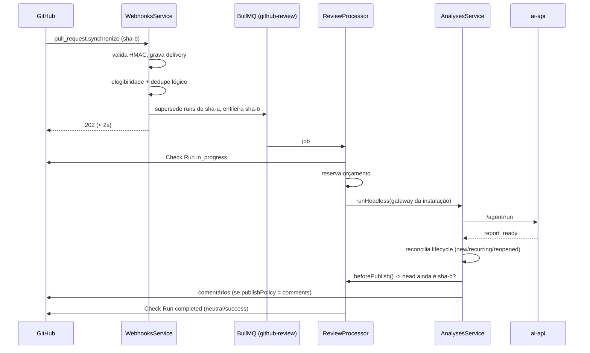

# SPEC: Revisão automática via GitHub App

**Status:** Implementado (P1)

**Data:** 2026-09-01

**PRD:** [PRD.md](./PRD.md)

## 1. Objetivo técnico

Fazer o Cast Review rodar sozinho no fluxo de entrega: quando uma pull request é aberta contra uma branch alvo, a análise dispara; a cada novo commit dessa PR, ela roda de novo sobre o head atual, complementando o histórico de findings da PR em vez de recomeçar do zero.

Nada disso pode depender de uma sessão de usuário no browser. A automação vive em três peças novas e uma refatoração:

| Peça | Responsabilidade |
| --- | --- |
| `GithubAppModule` (Nest) | Instalação, configuração por repositório, webhook, fila, Check Run, orçamento |
| `GithubAppService` | Fachada do módulo, no mesmo padrão de `RepositoriesService`: instancia os use-cases e expõe métodos finos |
| `AnalysesService.runHeadless` | Mesma pipeline da análise manual, sem `Request`/`Response` HTTP |
| `GithubPullGateway` | Contrato de acesso ao GitHub, com duas implementações: PAT do usuário e token de instalação |
| `ai-api` | Inalterado — continua sem saber quem chamou |

## 2. Decisões travadas

| ID | Decisão | Justificativa |
| --- | --- | --- |
| D1 | A automação reusa a pipeline existente, não uma cópia | Uma review automática e uma manual precisam produzir o mesmo relatório |
| D2 | `AnalysesService` recebe um `GithubPullGateway`, não `RepositoriesService` | O PAT pessoal e o token de instalação são intercambiáveis para a pipeline |
| D3 | Execução assíncrona em BullMQ, fila própria `github-review` | Indexação e revisão têm perfis de duração e retry diferentes |
| D4 | Dupla idempotência: `delivery_id` e chave lógica `(repo, PR, SHA, config)` | Cobre redelivery do GitHub e retry interno (GA-06) |
| D5 | Head SHA é reconferido antes de publicar e antes de concluir o check | Uma corrida entre pushes nunca publica review velha (GA-11) |
| D6 | Reserva de orçamento em transação `SERIALIZABLE` antes da chamada ao LLM | Dois webhooks simultâneos não somam acima do teto |
| D7 | Veredito de produto nunca conclui o check como `failure` | Modo informativo: só falha operacional é `failure` (GA-13, princípio 5/8) |
| D8 | Publicar comentários é opt-in por repositório (`check_only` por padrão) | Rollout escalonado do PRD (etapas 3 e 4) |
| D9 | Payload bruto é reduzido na escrita e expirado por retenção | Log e banco nunca guardam diff, corpo de PR ou credenciais |
| D10 | Token de instalação vive só em cache de memória, com margem de expiração | Nunca é persistido (gate de lançamento 5) |
| D11 | Lifecycle de findings roda sem alteração no caminho automático | É o que faz "complementar a última análise" acontecer de graça |
| D12 | Um controller por módulo; lógica em `use-cases/`, fachada fina | Convenção do projeto (`repositories`, `finding-cases`); o webhook é só mais uma rota, com `@Public()` no handler |

## 3. Como o "complementa a cada commit" funciona

O comportamento pedido — analisar na abertura e reanalisar a cada commit, complementando — não exigiu um mecanismo novo. Ele é a composição de três coisas:

1. **O evento.** `synchronize` chega a cada push na PR e é elegível por padrão.
2. **A supersedência.** Ao enfileirar o run do SHA novo, os runs abertos da mesma PR viram `superseded`; jobs ainda na fila são removidos, jobs já em execução são barrados na hora de publicar.
3. **O lifecycle já existente.** `FindingLifecycleUseCase` casa os findings da análise atual com os `finding_cases` da mesma PR (escopo `user + owner + repo + pullNumber`). Cada finding sai classificado como `new`, `recurring` ou `reopened`, e o que sumiu vira `not_observed`.

Ou seja: o segundo commit não produz uma review isolada. Ele produz uma review que sabe o que já tinha sido dito, o que voltou e o que o autor já marcou como risco aceito — e o Check Run mostra essa contagem.



## 4. Modelo de dados

Quatro tabelas novas (migration `1788500000000-CreateGithubApp`) e duas colunas em `analyses` (`1788400000000-AddAnalysisOrigin`).

| Tabela | Papel | Chaves relevantes |
| --- | --- | --- |
| `github_installations` | Instalação e seu vínculo com um usuário Cast | unique `installation_id`; `owner_user_id` nulo = pendente |
| `github_app_repositories` | Um repositório concedido + sua configuração | unique `(installation_id, github_repo_id)`; `enabled` default `false` |
| `github_webhook_deliveries` | Auditoria de toda entrega recebida | unique `delivery_id` (GA-06, primeira camada) |
| `github_review_runs` | Uma execução lógica de revisão | unique `(repository_id, pull_number, head_sha, config_hash)` (GA-06, segunda camada) |

`analyses.origin` (`manual` \| `github_app`) e `analyses.head_sha` tornam toda análise automática auditável (GA-09) sem quebrar as linhas antigas, que assumem `manual` pelo default.

### Estados de `github_review_runs`

```
queued ──► running ──┬──► completed
                     ├──► failed       (falha operacional, check = failure)
                     ├──► skipped      (regra de negócio, check = neutral)
                     └──► superseded   (chegou SHA novo; não publica como atual)
```

Nenhuma transição sai de um estado terminal. Um job que acorda para um run terminal é descartado sem efeito colateral — é o que torna o retry do BullMQ seguro.

## 5. Fronteiras e contratos

### 5.1 Refatoração do `AnalysesService`

O serviço tinha `Response` do Express e `RepositoriesService` cravados. Duas costuras foram abertas:

```ts
interface AnalysisEventSink { write(chunk: string): unknown; end(): unknown }

interface AnalysisPipelineContext {
  github: GithubPullGateway;
  publishingUser: CurrentUserData;
  beforePublish?: () => Promise<{ allowed: boolean; reason?: string }>;
  onEvent?: (event: AgentEvent) => void | Promise<void>;
}
```

O caminho manual passa o `Response` como sink e não passa contexto — comportamento idêntico ao anterior. O caminho automático passa um sink nulo, o gateway da instalação e o `beforePublish` que reconfere o head SHA.

`PublishPolicy.publish` ganhou o valor `none`: gera o relatório e o lifecycle, não toca na PR. É o default da automação (`check_only`).

### 5.2 `GithubPullGateway`

Interface extraída de `RepositoriesService` com os 10 métodos que a pipeline realmente usa. `RepositoriesService` a satisfaz sem mudança de código. `InstallationGithubGateway` a implementa sobre tokens de instalação.

Diferença importante: `loginFor()` no gateway da App devolve `<slug>[bot]`, não o dono do repositório. É a identidade usada para reconhecer e apagar comentários que a própria App publicou em execuções anteriores da mesma PR.

### 5.3 Endpoints

| Método | Rota | Uso |
| --- | --- | --- |
| `GET` | `/github-app/install-url` | Devolve URL de instalação + `state` assinado |
| `POST` | `/github-app/installations` | Vincula `installation_id` ao usuário (GA-01) |
| `GET` | `/github-app/installations` | Lista instalações do usuário e seus repositórios |
| `POST` | `/github-app/installations/:id/refresh` | Ressincroniza repositórios concedidos |
| `POST` | `/github-app/installations/:id/pause` \| `/resume` | Pausa/retoma tudo (GA-15) |
| `DELETE` | `/github-app/installations/:id` | Revoga o vínculo local |
| `PATCH` | `/github-app/repositories/:id` | Liga/desliga e configura (GA-03, GA-04) |
| `GET` | `/github-app/repositories/:id/runs` | Histórico de execuções |
| `POST` | `/github-app/repositories/:id/runs` | Roda uma PR manualmente |
| `POST` | `/github-app/runs/:id/retry` | Reprocessa uma execução |
| `POST` | `/github-app/webhooks` | Público; autenticado por HMAC |

Toda rota, exceto o webhook, exige JWT e filtra por `owner_user_id`. Um usuário sem ownership recebe `404`, não `403` — não confirmamos a existência da instalação alheia.

## 6. Segurança

- **Assinatura antes de tudo.** `main.ts` habilita `rawBody`; o corpo já parseado não reproduz os bytes assinados. Comparação com `timingSafeEqual` e checagem de tamanho antes, para não vazar tempo nem lançar.
- **`state` assinado.** A URL de instalação carrega um HMAC de `{userId, exp}` com TTL de 30 minutos. Sem ele, qualquer um que descobrisse um `installation_id` poderia reivindicá-lo.
- **Token de instalação efêmero.** Cache em memória com margem de 60s antes do vencimento, descartado em qualquer erro 4xx/5xx e ao suspender/remover a instalação. Nunca vai para o banco nem para log.
- **Chave privada da App.** Lida de `GITHUB_APP_PRIVATE_KEY_BASE64` (preferida) ou `GITHUB_APP_PRIVATE_KEY`. Nunca é logada nem devolvida por endpoint.
- **Payload reduzido na escrita.** `redactPayload` guarda apenas ação, repositório, número da PR, SHA, branch base, draft e estado. Diff, corpo da PR e URLs de token nunca chegam ao banco. Um job de retenção zera o campo depois de `GITHUB_WEBHOOK_PAYLOAD_RETENTION_DAYS` (7 por padrão), preservando os metadados de auditoria.
- **Eventos de instalação suspensa/removida** são rejeitados antes de enfileirar trabalho.

## 7. Permissões mínimas da App

| Permissão | Nível | Por quê |
| --- | --- | --- |
| Contents | Read | Ler arquivos e `conventions.md` no head e na base |
| Pull requests | Read & write | Ler diff/arquivos e publicar review quando `comments` estiver ligado |
| Checks | Read & write | Criar e concluir o Check Run |
| Metadata | Read | Obrigatório pelo GitHub |

Evento assinado: `pull_request`. Nada além disso. Os eventos `installation` e `installation_repositories` chegam automaticamente a toda GitHub App e não são assináveis — o manifesto é rejeitado se você tentar declará-los.

## 8. Orçamento

`BudgetService.reserve` roda dentro de `transaction('SERIALIZABLE')`: soma o que os outros runs do mês já comprometeram (custo real quando existe, reserva quando ainda não) e recusa se a soma com a nova reserva passar do teto. A recusa vira `skipped` com motivo `budget_exceeded` e um Check Run `neutral` explicando — nunca um retry infinito.

Ao terminar, `settle` grava o custo real vindo de `review.usage.costUsd`. Um run cancelado reporta o que já gastou; nunca finge custo zero.

## 9. Observabilidade

Todo log usa identificadores: `reviewRunId`, `analysisId`, `deliveryId`, `installationId`, `pullNumber`, `headSha`, `durationMs`. Nenhum log carrega diff, código, corpo de comentário ou credencial. Os eventos nomeados são: entrega recebida/duplicada, execução enfileirada, superseded, pulada com motivo, concluída com veredito, falha.

## 10. Cobertura de teste

100 testes novos no módulo (`npx jest src/modules/github-app`), organizados pelos gates de lançamento do PRD:

| Gate do PRD | Onde é provado |
| --- | --- |
| 1. Redelivery produz uma execução lógica | `webhooks.service.spec.ts` — dedupe por `delivery_id` e por chave lógica |
| 2. Push B impede A de publicar | `review.processor.spec.ts` — `beforePublish` e conclusão `superseded` |
| 3. Pausa interrompe novos jobs | `webhooks.service.spec.ts` + `review.processor.spec.ts` |
| 4. Teto de custo concorrente | `budget.service.spec.ts` — reserva não commitada conta no total |
| 5. Token de instalação sem persistência | `installations.service.spec.ts` — `forget` no unlink/suspend |
| 6. Falhas produzem estado recuperável | `review.processor.spec.ts` — erro vira `failed` + check `failure` |
| 7. Sem ownership não lê nem altera | `installations.service.spec.ts` — `NotFoundException` para outro usuário |

## 10.1 Organização do módulo

```
github-app/
├── github-app.controller.ts        # único controller; webhook é rota @Public()
├── github-app.service.ts           # fachada: instancia os use-cases
├── github-app.module.ts
├── config/
├── domain/                         # regras puras, sem I/O
│   ├── github-app.types.ts
│   ├── eligibility.rules.ts
│   ├── config-hash.ts
│   ├── check-run-output.ts
│   └── webhook-payload.ts
├── entities/ · dtos/
├── infrastructure/
│   ├── github/                     # token, gateway, check-run
│   │   └── security/               # app-jwt, webhook-signature, install-state
│   ├── persistence/                # repositórios TypeORM
│   └── queue/                      # constantes + worker BullMQ
└── use-cases/
    ├── shared/                     # ownership, presenter, readiness
    ├── link-installation/ · list-installations/ · get-installation/
    ├── refresh-installation/ · pause-installation/ · unlink-installation/
    ├── sync-repositories/ · update-repository-config/
    ├── list-review-runs/ · trigger-review-run/ · retry-review-run/
    ├── handle-webhook/ · enqueue-review-run/
    └── reserve-budget/
```

Três eixos, alinhados com o que a literatura de monolito modular recomenda e com o que o resto deste projeto já faz:

- **`domain/`** — regras puras, sem I/O: quem é elegível, o que entra no hash de configuração, como um veredito vira conclusão de check. Testável sem mock.
- **`infrastructure/`** — tudo que fala com o mundo: GitHub (e sua criptografia), Postgres, BullMQ.
- **`use-cases/`** — um slice vertical por operação, no padrão de `repositories/` e `finding-cases/`.

Na raiz sobram três arquivos: o controller, a fachada e o módulo. Um controller por módulo; o webhook é apenas mais uma rota, marcada `@Public()` porque sua autenticidade vem do HMAC, não do JWT.

## 11. Fora deste SPEC

Continua valendo o "fora de escopo" do PRD: sem bloqueio de merge, sem GitLab/Bitbucket, sem comandos por comentário, sem RBAC completo, sem faturamento por instalação. `staleIndexBehavior` está persistido e exposto na UI, mas a checagem de índice stale antes da análise ficou para o P2 — hoje o valor é gravado e não altera o fluxo.
